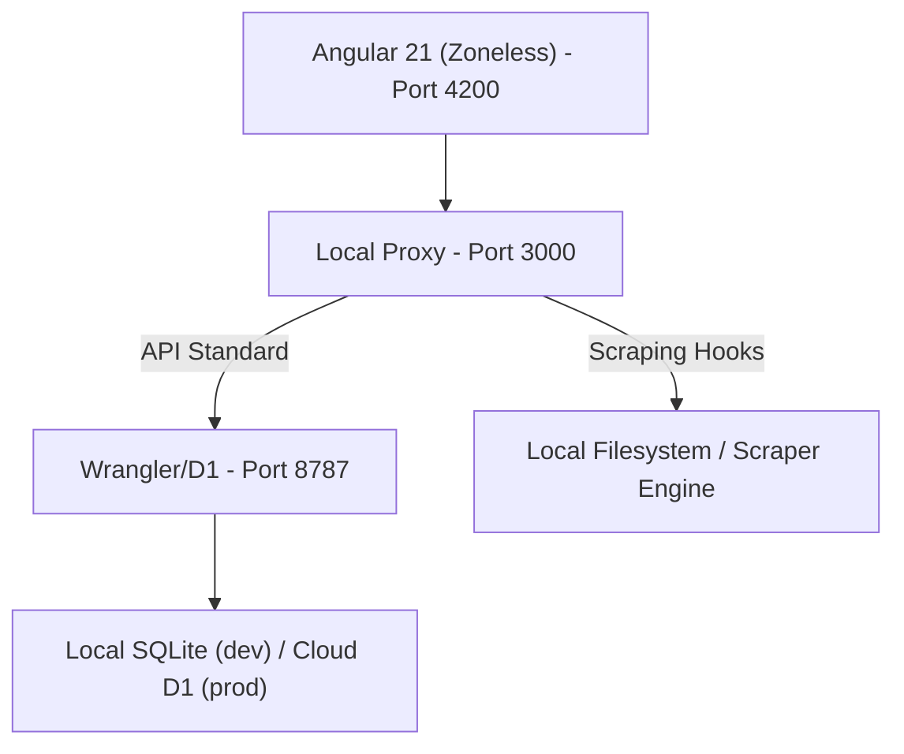

# 🎮 Gaggledex: Collection Tracker

A high-performance portal for tracking and reconciling video game and figure collections. Built with **Angular 21**, the system utilizes a **Signals-based, Zoneless architecture** and a premium **Cyberpunk "Gaggledex" aesthetic**.

---

## 🏗️ Architecture & Internal Logic

The system is built on a hybrid architecture that combines local Node.js capabilities with Cloudflare serverless environments.

### 🌓 Core Components
- **Production Layer (`worker/worker.ts`)**: A Cloudflare Worker that serves the API and interacts with a **Cloudflare D1 SQL Database**. It handles core operations for games, figures, and platforms.
- **Local Bridge (`scripts/local_server.ts`)**: A Node.js proxy that intercepts filesystem and scraping tasks (like IGDB metadata reconciliation) while forwarding standard API requests to the local worker instance.
- **Signals Core**: Frontend state management is powered by Angular Signals (`signal`, `computed`, `toSignal`), providing efficient UI updates without the overhead of `zone.js`.

### 🗺️ System Map


---

## 🚀 Data Infrastructure & Metadata

The system maintains a rigid metadata reconciliation pipeline to ensure collection accuracy.

### 1. High-Fidelity IGDB Reconciliation (`scripts/scrape.ts`)
Authoritative metadata is fetched from IGDB using a sophisticated two-phase matching algorithm:
- **Phase 1 (Strict)**: Locks search to the exact platform ID for high-fidelity matching.
- **Phase 2 (Global)**: Falls back to a global search for unmatched items, surfaced for manual verification.
- **Punctuation Awareness**: Correctly handles titles with complex characters like `+`, `:`, and `-`.
- **Regional Prioritization**: Prioritizes North American (NA) launch dates and regional names, stored in the `region` field.
- **Manual Overrides**: Supports specific regional overrides for legacy titles where NA data is missing.

### 2. Platform Migration & Hierarchy
The database maintains strict platform alignment with IGDB canonical standards:
- **ID-Based Mapping**: The `games` table uses an integer `platform_id` that maps to the canonical `platforms.id`.
- **Parent-Child Hierarchy**: Supports a `parent_platform_id` for specialized hardware.
    - *Example*: **PlayStation VR** and **PlayStation VR2** are mapped as children to **PS4** and **PS5**, respectively, for unified filtering.
- **Stable UI Ordering**: Chronological sorting is powered by verified launch dates normalized as ISO 8601 strings.

### 3. Database Schema Overview
The `games` table has been modernized for high-fidelity tracking:
- **`stable_id`**: The numeric primary key for consistent UI identity.
- **`platform_id`**: Foreign key to the `platforms` table.
- **Metadata**: Includes `summary`, `genres`, `igdb_id`, and a prioritized `region` field.
- **State**: Persistent `played` and `backed_up` booleans for collection status.

### 4. Local Environment Sync (`scripts/sync_to_d1.ts`)
Repairs performed on the local `collection.sqlite` are automatically propagated to the Cloudflare D1 local state during startup to ensure immediate visibility.

### 🎨 Branding & Aesthetics
The application features a custom **Gaggledex Cyberpunk Theme**:
- **Void Purple (#1A0B2E)**: A deep, rich base background for high-contrast viewing.
- **Neon Fuchsia (#FF007F)**: Primary accent color for interactive elements and brand identifiers.
- **Cyber Lime (#39FF14)**: High-visibility accents for status indicators and success states.
- **SVG Branding**: A custom-coded vector favicon for perfect clarity and transparency.

### ⚡ Performance & Engineering Standards

#### Optimized Rendering Pipeline
We prioritize a "buttery smooth" experience even with large collections:
- **Aggressive Layer Management**: Avoids GPU thrashing by minimizing forced rendering layers (`will-change`).
- **Selective Compositing**: High-cost effects like `backdrop-filter: blur()` are preserved for UI shells but removed from repeating grid items to maintain 60fps scrolling.
- **Lazy Loading**: Native `loading="lazy"` and `decoding="async"` for all cover art, with explicit dimensioning to prevent layout shifts.
- **Scroll Optimization**: Zero-cost scroll tracking that captures state on navigation without impacting frame rates.

#### Responsive Design
The UI is built to be fully accessible on any device:
- **Adaptive Filter Bar**: Intelligently stacks into a grid or single column on mobile to prevent content overflow.
- **Glassmorphism 2.0**: Sophisticated translucent panels with high contrast for legible reading in any light environment.

#### Zoneless Reactivity
We have eliminated `zone.js` for improved UI efficiency. Requirements:
- Use **Angular Signals** for all state changes.
- `OnPush` change detection throughout the component tree.
- Signal-bound events for user interaction.

### Testing Suite
The project uses **Vitest** for a unified testing environment across the frontend and the backend worker.
- **Frontend Specs**: Located alongside components; utilize `JSDOM` for component testing.
- **Worker Specs**: Located in `worker/`, utilize in-memory SQLite for API logic verification.

Run all tests:
```bash
npm run test  # Runs the full project-wide unified Vitest suite
```

---

## 📋 Roadmap & Known Issues

- [ ] **Overhaul Series Handling**: Update series and franchise handling to treat IGDB as authoritative.
- [ ] **Worker-Side Image Caching**: Implement a KV-based cache for IGDB cover art to reduce external API dependency.
- [ ] **Automated Watchlists**: Implement a system to watch specific series and automatically surface new releases as 'Wanted'.
- [ ] **Heuristic Scrubber**: Introduce an automated web-search heuristic to determine physical release status for IGDB games and only track those with physical releases.
