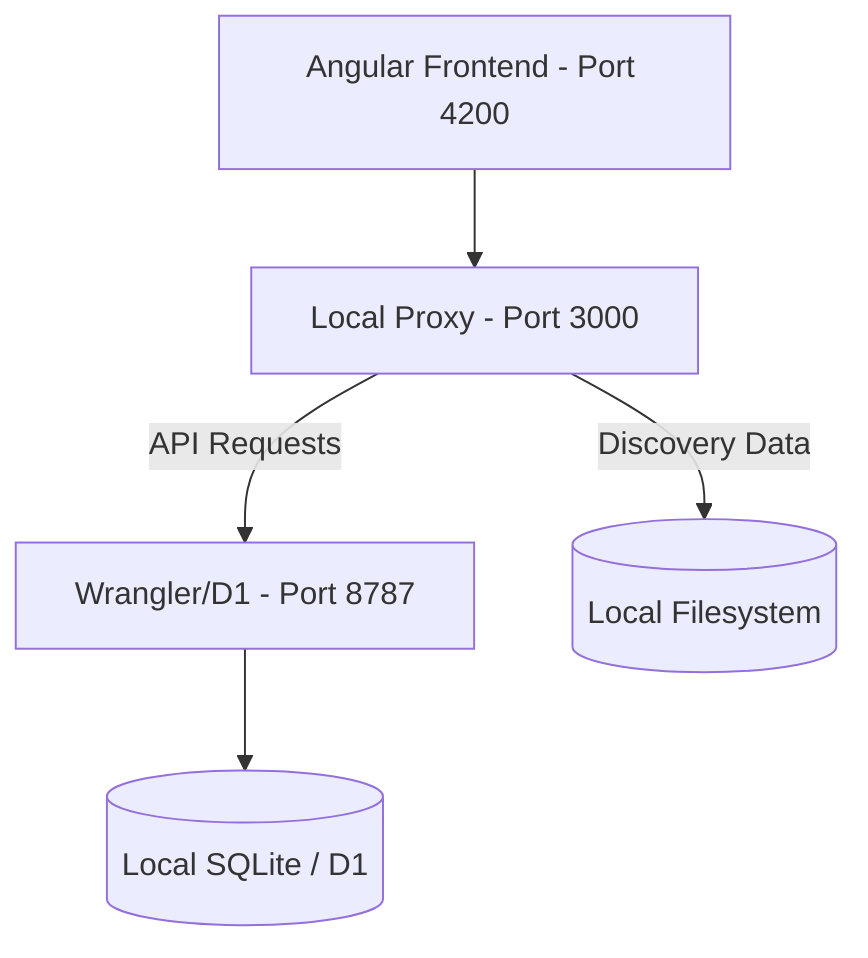

# 🎮 Video Game Collection Tracker

A high-fidelity, hybrid-architecture web application for tracking and reconciling video game and figure collections. Designed to bridge the gap between local development workflows and Cloudflare serverless environments.

---

## 🏗️ Architecture Overview

The system uses a **Hybrid Local/Cloud Architecture** to ensure perfect parity between development and production.

### 🌓 The Hybrid Concept
- **Production Layer (`worker/worker.ts`)**: A high-performance Cloudflare Worker querying a **D1 SQL Database**.
- **Local Bridge (`scripts/local_server.js`)**: A Node.js proxy that intercepts specialized filesystem tasks (like Discovery scraping) while forwarding standard API requests to a local instance of the Production Worker.

### 🗺️ System Map


---

## 🚀 Getting Started

### 1. Prerequisites
- Node.js (v18+)
- Cloudflare Wrangler (`npm install -g wrangler`)
- A healthy `collection.sqlite` in the root folder.

### 2. Launching the environment
We use a unified orchestrator to manage the database sync and all three server layers:
```bash
node scripts/dev.js
```
*This command synchronizes the local D1 instance, starts the Proxy, the Worker, and the Frontend simultaneously.*

---

## 🛠️ Data & Reconciliation

### The Source of Truth
The `collection.sqlite` file in the root is the **local source of truth**. 
- Every game is assigned a **`stable_id`** (Auto-incrementing Integer) to ensure permanent links across different scraping sessions.
- **1,977 Reconciled Games**: This is the current benchmark for a fully synced collection.

### Discovery & Scraping
The project includes specialized scrapers to identify "unlinked" games in your collection and find their IGDB counterparts:
1. Run `npm run scrape` to generate a `discovery_report.md`.
2. Use the **Discovery** tab in the UI to link items.
3. This updates the local `collection.sqlite` immediately.

---

## 🧪 Engineering Standards

### Unit Testing
We maintain high coverage across both the frontend and the backend logic:
- **Worker (Core Logic)**: Located in `worker/`, tested via `Vitest` using high-stability in-memory SQLite mocking.
- **Frontend (UI)**: Located in `src/`, tested via `Jasmine/Karma`.

Run tests:
```bash
npm run test:worker  # Runs backend API tests
npm run test         # Runs frontend unit tests
```

### CI/CD
A GitHub Action is configured in `.github/workflows/ci.yml` to automatically:
1. Install dependencies.
2. Run ESLint to ensure code quality.
3. Execute all Worker and Frontend unit tests.

---

## 📝 Future Work
- **Overhaul Series Handling**: Update series and franchise handling to treat IGDB as authoritative.
- **Visual Improvements**: Add images to collection pages and update the favicon.
- **Database Upgrades**: Add played and backed up booleans to games and remove queue modeling.
- **Mobile Layout**: Enhance the collection view for smaller devices.
- **Image Caching**: Implement a worker-side cache for IGDB cover art to reduce external API calls.
- **Adding Items**: Add a way to watch certain series or other groupings and scrape the various source APIs for missing items to add to the database as wanted. This may be used for adding a series as wanted and including all items that exist or finding new releases in groupings already included.

---

## 📜 Known Issues
- Some platform launch dates are missing.
- Game regions are missing.
- Some games still aren't matched to IGDB, and IGDB doesn't model physical games perfectly, so some games may remain unmatched indefinitely. Perhaps we can introduce a heuristic involving an automatic web search to determine whether a physical release existed.
