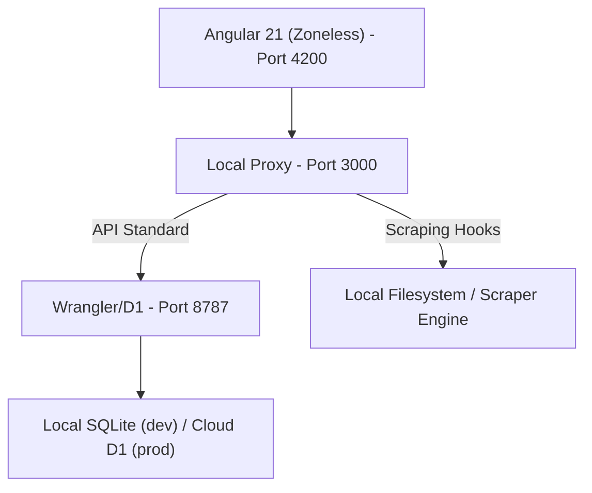

# 🎮 Video Game & Figure Collection Tracker

A high-fidelity, high-performance web application for tracking and reconciling video game and figure collections. Modernized with **Angular 21**, the system utilizes a **Signals-first, Zoneless architecture** to deliver state-of-the-art reactivity and performance.

---

## 🏗️ Architecture & Internal Logic

The system is built on a **Hybrid Local/Remote Engine** designed to bridge specialized local node.js capabilities with global Cloudflare serverless environments.

### 🌓 The Hybrid Concept
- **Production Layer (`worker/worker.ts`)**: A high-performance Cloudflare Worker that serves the API and interacts with a **Cloudflare D1 SQL Database**. It handles core CRUD operations for games, figures, and platforms.
- **Local Bridge (`scripts/local_server.js`)**: A Node.js proxy that intercepts specialized filesystem and scraping tasks (like IGDB metadata reconciliation) while forwarding standard API requests to a local instance of the Production Worker.
- **Signals-First Core**: All frontend state management is powered by Angular Signals (`signal`, `computed`, `toSignal`). This eliminates the need for legacy `zone.js` overhead and provides fine-grained, efficient UI updates.

### 🗺️ System Map


---

## 🚀 User-Facing Behavior

1. **High-Performance Collection Viewing**: Instantly browse thousands of games and figures with infinite scrolling and zero-lag filtering powered by synchronous Signals.
2. **Intelligent Discovery**: The "Discovery" module identifies items in your collection that lack metadata and provides a high-fidelity reconciliation UI to link them with authoritative sources (IGDB).
3. **Reactive state Preservation**: Navigating between details and lists preserves your scroll position and filter state automatically via the `CollectionService`.
4. **Rich Metadata Display**: Detailed views for every item, featuring platform-specific information, ownership status, and high-fidelity gradients.

---

## 🛠️ Performance & Engineering Standards

### ⚡ Zoneless Reactivity
We have eliminated `zone.js` for maximum performance. This requires:
- Explicit use of **Angular Signals** for all state changes.
- `OnPush` change detection throughout the component tree.
- Manually triggered or Signal-bound events for interaction.

### 🧪 Unified Testing Suite
The project uses **Vitest** for a unified, high-speed testing environment across both the frontend and the backend worker.
- **Frontend Specs**: Located alongside components; use `JSDOM` and our "Guaranteed Execution" initialization pattern to bypass configuration resolution issues.
- **Worker Specs**: Located in `worker/`, use in-memory SQLite for high-stability API logic testing.

Run all tests:
```bash
npm run test  # Runs the full project-wide unified Vitest suite
```

### 📦 Production Build
The application is optimized for Cloudflare deployment:
```bash
npm run build # Performs a high-fidelity AOT-compiled production build
```

---

## 📋 TODO: Known Issues & Future Work

> [!IMPORTANT]
> This section tracks our roadmap for future high-performance enhancements.

- [ ] **Overhaul Series Handling**: Update series and franchise handling to treat IGDB as authoritative.
- [ ] **Visual Improvements**: Add rich cover art to collection pages and update the application favicon.
- [ ] **Database Schema Upgrades**: Add `played` and `backed_up` booleans to games; remove legacy queue modeling.
- [ ] **Mobile Layout Optimization**: Enhance the collection view and Discovery reconciliation UI for smaller devices.
- [ ] **Worker-Side Image Caching**: Implement a KV-based cache for IGDB cover art to reduce external API dependency.
- [ ] **Automated Watchlists**: Implement a system to watch specific series and automatically surface new releases as 'Wanted'.
- [ ] **Legacy Data Cleanup**: Some platform launch dates and game regions are currently missing or un-reconciled.
- [ ] **Heuristic Scrubber**: Introduce an automated web-search heuristic to determine physical release status for IGDB games and only track those with physical releases.
