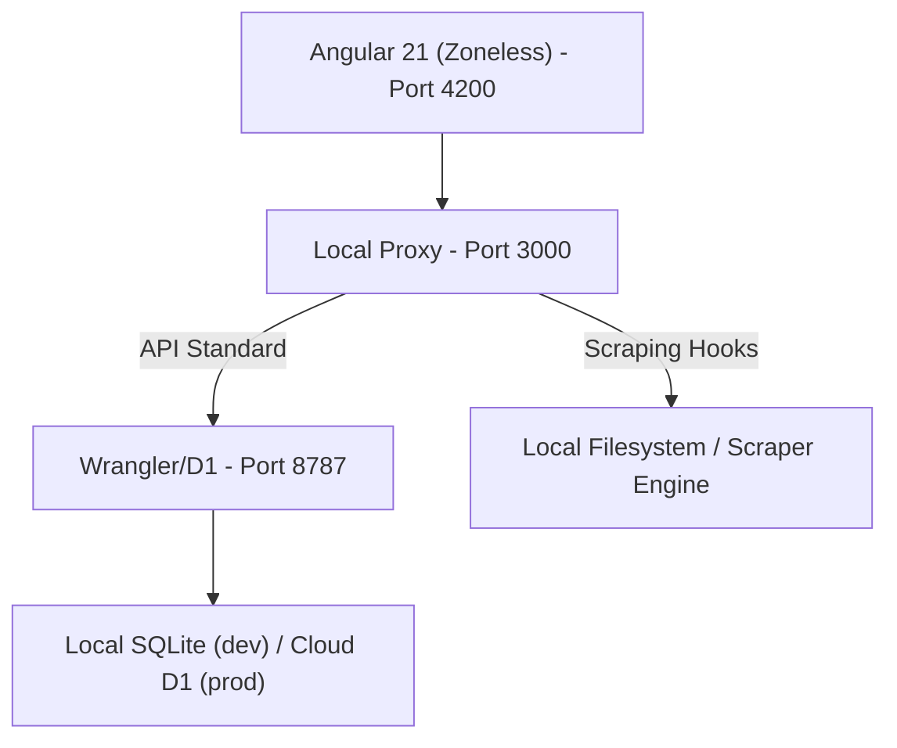

# 🎮 Video Game & Figure Collection Tracker

A web application for tracking and reconciling video game and figure collections. Built with **Angular 21**, the system utilizes a **Signals-based, Zoneless architecture** for state management and UI reactivity.

---

## 🏗️ Architecture & Internal Logic

The system is built on a hybrid architecture that combines local Node.js capabilities with Cloudflare serverless environments.

### 🌓 Core Components
- **Production Layer (`worker/worker.ts`)**: A Cloudflare Worker that serves the API and interacts with a **Cloudflare D1 SQL Database**. It handles core operations for games, figures, and platforms.
- **Local Bridge (`scripts/local_server.ts`)**: A Node.js proxy that intercepts filesystem and scraping tasks (like IGDB metadata reconciliation) while forwarding standard API requests to the local worker instance.
- **Signals Core**: Frontend state management is powered by Angular Signals (`signal`, `computed`, `toSignal`), providing efficient UI updates without the overhead of `zone.js`.

### 🗺️ System Map


---

## 🚀 Data Infrastructure & Metadata

The system maintains a rigid metadata reconciliation pipeline to ensure collection accuracy.

### 1. IGDB Reconciliation (`scripts/full_repair.ts`)
Authoritative metadata is fetched from IGDB using a strict normalized matching algorithm:
- Exact string matches are required to prevent sequels from incorrectly linking to their original titles (e.g., *Castlevania* vs. *Castlevania II*).
- Platform-specific filtering is applied to ensure items are linked to the correct console versions, preventing cross-platform mismatches (e.g., *Castlevania* (NES) vs. its arcade or microcomputer versions).
- Items that do not meet strict matching criteria are surfaced in the Discovery module for manual review.

### 2. Platform Sorting (`scripts/fix_platforms.ts`)
Chronological sorting in filters is powered by North American (NA) launch dates:
- Missing launch dates are retrieved from IGDB version release data (Region ID 2).
- Dates are normalized as consistent ISO 8601 strings (`YYYY-MM-DD`) across the database to ensure stable sorting.

### 3. Local Environment Sync (`scripts/sync_local_d1.ts`)
Repairs performed on the root `collection.sqlite` database are propagated to the active Cloudflare D1 local state. This ensures that metadata restoration is immediately visible in the development environment.

---

## 🛠️ Performance & Engineering Standards

### Zoneless Reactivity
We have eliminated `zone.js` for improved UI efficiency. Requirements:
- Use **Angular Signals** for all state changes.
- `OnPush` change detection throughout the component tree.
- Signal-bound events for user interaction.

### Testing Suite
The project uses **Vitest** for a unified testing environment across the frontend and the backend worker.
- **Frontend Specs**: Located alongside components; utilize `JSDOM` for component testing.
- **Worker Specs**: Located in `worker/`, utilize in-memory SQLite for API logic verification.

Run all tests:
```bash
npm run test  # Runs the full project-wide unified Vitest suite
```

---

## 📋 Roadmap & Known Issues

- [ ] **Overhaul Series Handling**: Update series and franchise handling to treat IGDB as authoritative.
- [ ] **Visual Improvements**: Improve various visual elements and update the application favicon.
- [ ] **Database Schema Upgrades**: Add `played` and `backed_up` booleans to games; remove legacy queue modeling.
- [ ] **Mobile Layout Optimization**: Enhance the collection view and Discovery reconciliation UI for smaller devices.
- [ ] **Worker-Side Image Caching**: Implement a KV-based cache for IGDB cover art to reduce external API dependency.
- [ ] **Automated Watchlists**: Implement a system to watch specific series and automatically surface new releases as 'Wanted'.
- [ ] **Heuristic Scrubber**: Introduce an automated web-search heuristic to determine physical release status for IGDB games and only track those with physical releases.
